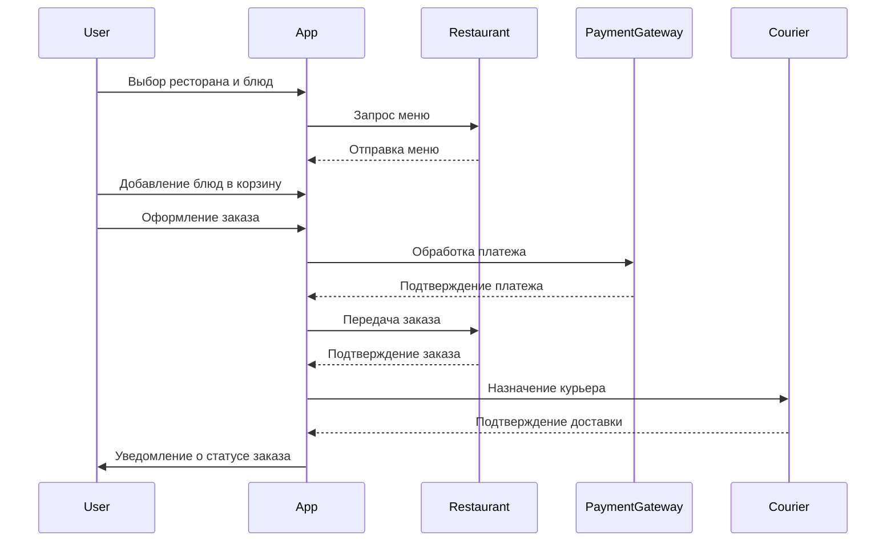
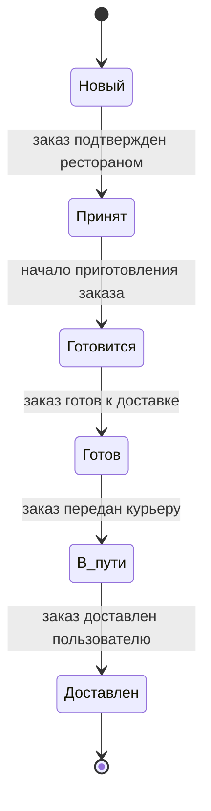
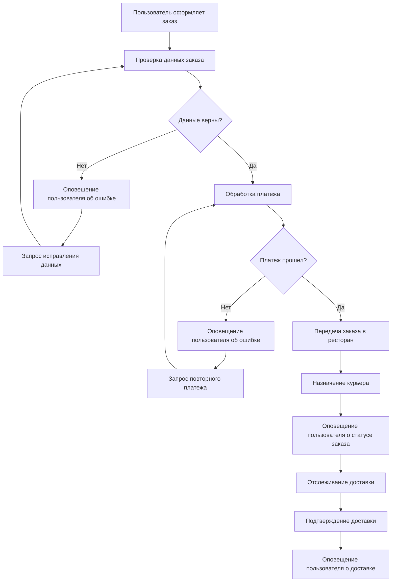
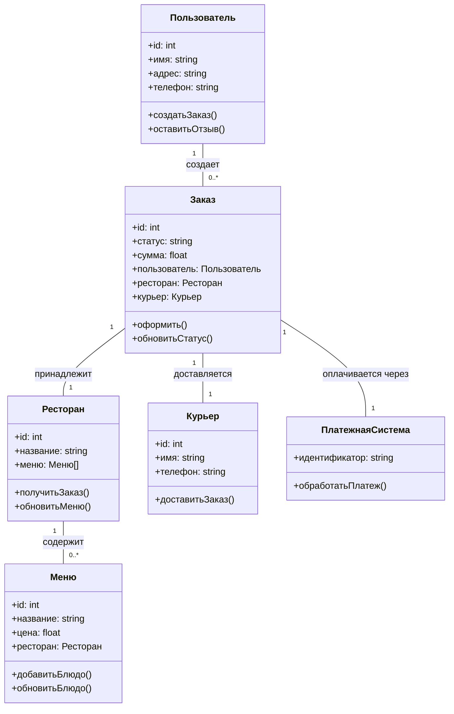

<h1 align="center">Исаков Артём Владиславович 239 группа</a> 
<h2 align="center">Технологии программирования ТЗ 3.</h2>
## Описание системы
Система для доставки еды через мобильное приложение позволяет пользователям заказывать блюда из ресторанов и получать их с доставкой на дом. Основные участники системы - это пользователи (клиенты), рестораны и курьеры. Система включает в себя следующие:
Пользователи, рестораны и курьеры могут зарегистрироваться и войти в систему.
Пользователи могут просматривать доступные рестораны и их меню, выбирать блюда и добавлять их в корзину.
Пользователи могут оформить заказ, выбрав адрес доставки и способ оплаты.
Обработка платежей через различные платежные системы.
Обрабатывание заказов, распределение их между курьерами, отслеживание статуса выполнения.
Информирование пользователей о статусе заказа через push-уведомления и SMS.
Пользователи могут оставлять отзывы о ресторанах и курьерах.

