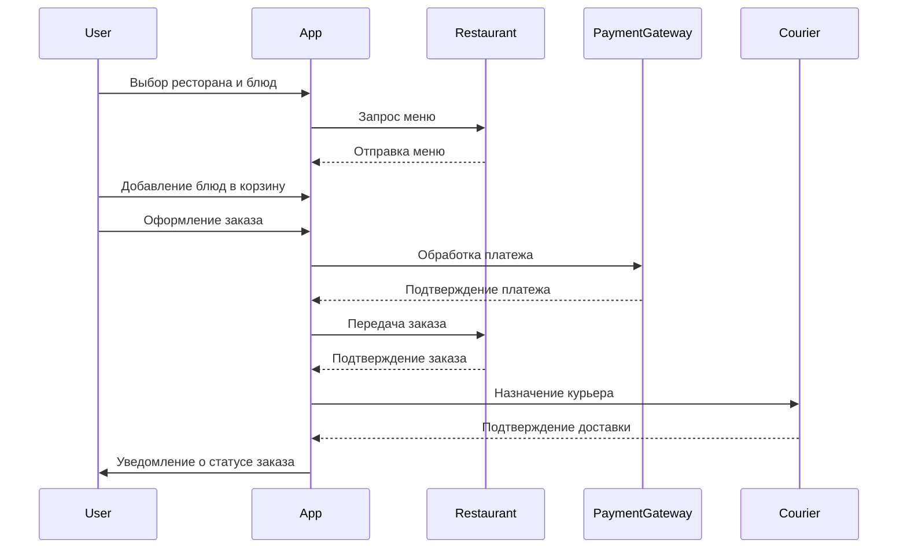
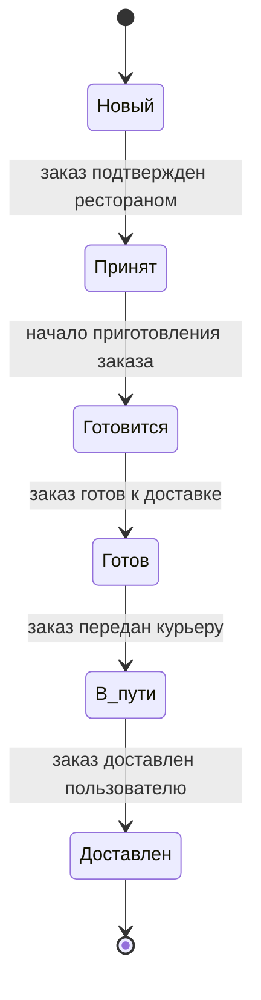
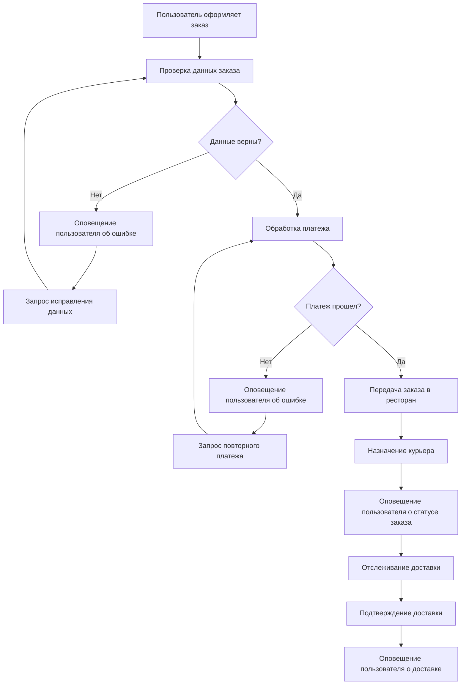
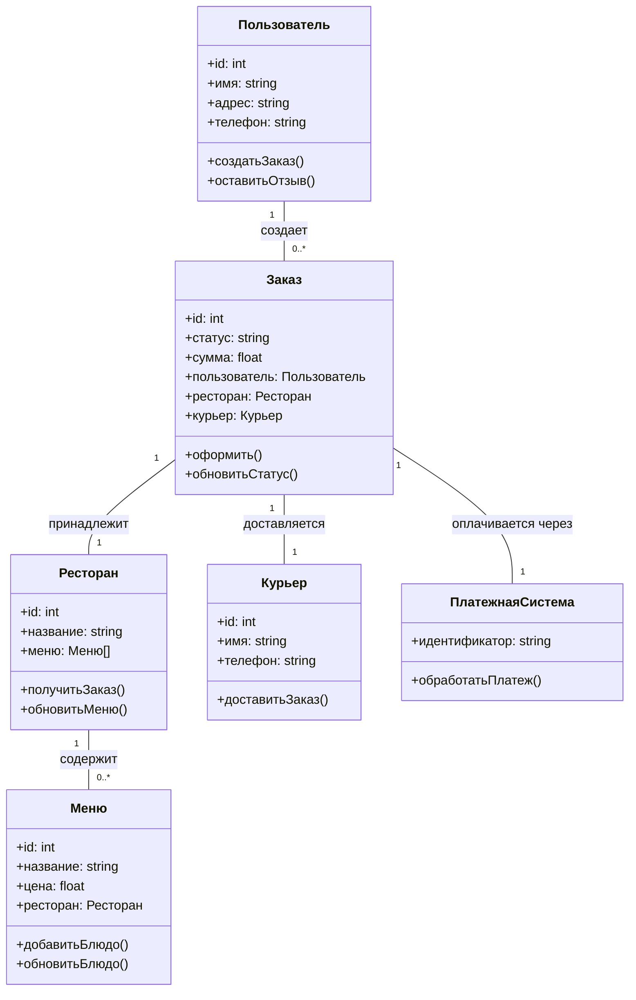

# TT-3
ТЗ 3 Исаков Артём Владиславович ББИ 239
```mermaid
usecase
actor "Пользователь" as user
actor "Ресторан" as restaurant
actor "Курьер" as courier

user -- (Регистрация и аутентификация)
user -- (Выбор ресторана и блюд)
user -- (Оформление заказа)
user -- (Оплата заказа)
user -- (Получение уведомлений)
user -- (Оставление отзыва)

restaurant -- (Регистрация и аутентификация)
restaurant -- (Добавление и обновление меню)
restaurant -- (Получение заказов)
restaurant -- (Просмотр отзывов)

courier -- (Регистрация и аутентификация)
courier -- (Получение заказа для доставки)
courier -- (Подтверждение доставки)

usecase "Регистрация и аутентификация" as UC1
usecase "Выбор ресторана и блюд" as UC2
usecase "Оформление заказа" as UC3
usecase "Оплата заказа" as UC4
usecase "Получение уведомлений" as UC5
usecase "Оставление отзыва" as UC6
usecase "Добавление и обновление меню" as UC7
usecase "Получение заказов" as UC8
usecase "Просмотр отзывов" as UC9
usecase "Получение заказа для доставки" as UC10
usecase "Подтверждение доставки" as UC11
```




