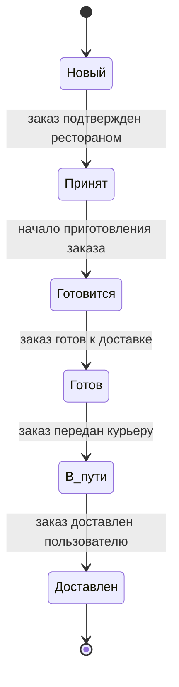
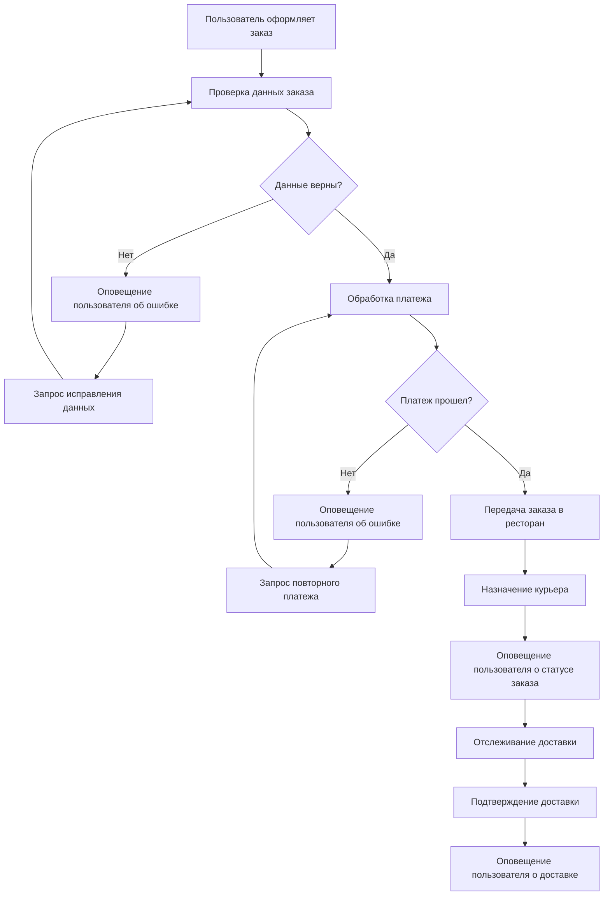
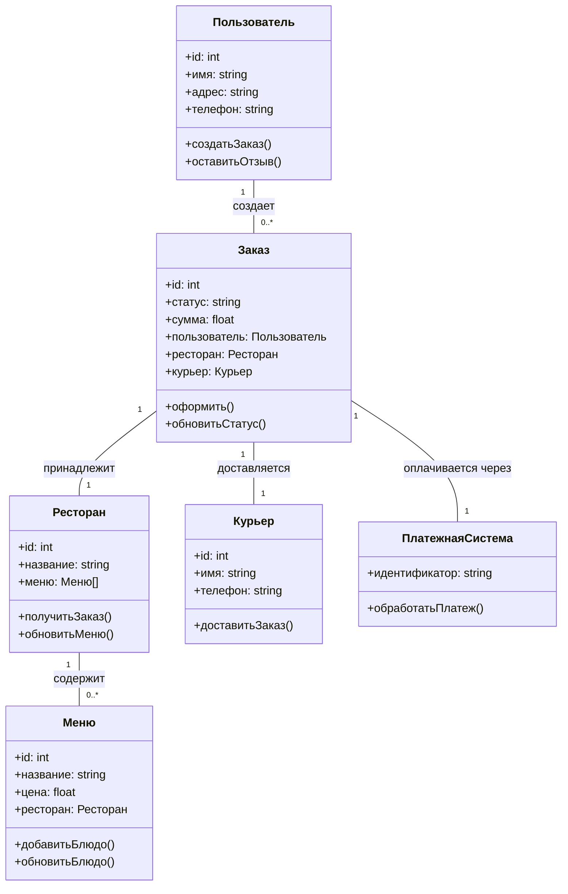

# TT-3
ТЗ 3 Исаков Артём Владиславович ББИ 239

```mermaid
stateDiagram
    [*] --> Новый
    Новый --> Принят: заказ подтвержден рестораном
    Принят --> Готовится: начало приготовления заказа
    Готовится --> Готов: заказ готов к доставке
    Готов --> В_пути: заказ передан курьеру
    В_пути --> Доставлен: заказ доставлен пользователю
    Доставлен --> [*]
```

```mermaid
flowchart TD
    A[Пользователь оформляет заказ] --> B[Проверка данных заказа]
    B --> C{Данные верны?}
    C -->|Нет| D[Оповещение пользователя об ошибке]
    D --> E[Запрос исправления данных]
    E --> B
    C -->|Да| F[Обработка платежа]
    F --> G{Платеж прошел?}
    G -->|Нет| H[Оповещение пользователя об ошибке]
    H --> I[Запрос повторного платежа]
    I --> F
    G -->|Да| J[Передача заказа в ресторан]
    J --> K[Назначение курьера]
    K --> L[Оповещение пользователя о статусе заказа]
    L --> M[Отслеживание доставки]
    M --> N[Подтверждение доставки]
    N --> O[Оповещение пользователя о доставке]
```

```mermaid
classDiagram
    class Пользователь {
        +id: int
        +имя: string
        +адрес: string
        +телефон: string
        +создатьЗаказ()
        +оставитьОтзыв()
    }
    class Заказ {
        +id: int
        +статус: string
        +сумма: float
        +пользователь: Пользователь
        +ресторан: Ресторан
        +курьер: Курьер
        +оформить()
        +обновитьСтатус()
    }
    class Ресторан {
        +id: int
        +название: string
        +меню: Меню[]
        +получитьЗаказ()
        +обновитьМеню()
    }
    class Курьер {
        +id: int
        +имя: string
        +телефон: string
        +доставитьЗаказ()
    }
    class Меню {
        +id: int
        +название: string
        +цена: float
        +ресторан: Ресторан
        +добавитьБлюдо()
        +обновитьБлюдо()
    }
    class ПлатежнаяСистема {
        +идентификатор: string
        +обработатьПлатеж()
    }
    
    Пользователь "1" -- "0..*" Заказ: создает
    Заказ "1" -- "1" Ресторан: принадлежит
    Заказ "1" -- "1" Курьер: доставляется
    Ресторан "1" -- "0..*" Меню: содержит
    Заказ "1" -- "1" ПлатежнаяСистема: оплачивается через
```
